# CHƯƠNG 2: PHÂN TÍCH YÊU CẦU HỆ THỐNG

## 2.1. Danh sách Use Case và Mô tả 

Dựa trên các tác nhân đã xác định ở Chương 1, dưới đây là bảng tổng hợp các Use Case (Ca sử dụng) của hệ thống Website đọc truyện tranh.

| STT | Use Case | Mô tả | Actor liên quan |
| :--- | :--- | :--- | :--- |
| 1 | Đăng ký | Người dùng tạo tài khoản mới để tham gia vào hệ thống. | Khách |
| 2 | Đăng nhập | Người dùng xác thực thông tin để truy cập vào các chức năng dành riêng cho thành viên. | Khách, Người dùng, Admin |
| 3 | Đăng xuất | Kết thúc phiên làm việc hiện tại. | Người dùng, Admin |
| 4 | Tìm kiếm truyện | Tìm kiếm truyện theo từ khóa (tên truyện, tác giả) hoặc lọc theo thể loại, trạng thái. | Khách, Người dùng, Admin |
| 5 | Xem chi tiết truyện | Xem thông tin đầy đủ của một bộ truyện (tóm tắt, tác giả, danh sách chương, thể loại). | Khách, Người dùng, Admin |
| 6 | Đọc truyện | Xem nội dung hình ảnh của các chương truyện. | Khách, Người dùng, Admin |
| 7 | Xem bình luận | Xem danh sách các bình luận của độc giả khác tại trang truyện hoặc chương. | Khách, Người dùng, Admin |
| 8 | Quản lý thông tin cá nhân | Cập nhật thông tin tài khoản như ảnh đại diện, mật khẩu, tên hiển thị. | Người dùng, Admin |
| 9 | Theo dõi truyện (Follow) | Thêm truyện vào danh sách yêu thích để nhận thông báo hoặc truy cập nhanh. | Người dùng, Admin |
| 10 | Bình luận | Gửi ý kiến, đánh giá hoặc thảo luận về truyện/chương truyện. | Người dùng, Admin |
| 11 | Xem lịch sử đọc | Xem danh sách các truyện và chương đã đọc gần đây. | Người dùng, Admin |
| 12 | Quản lý truyện cá nhân | Đăng tải bộ truyện mới, chỉnh sửa thông tin hoặc xóa truyện do chính mình tạo ra. | Người dùng |
| 13 | Quản lý người dùng | Xem danh sách, phân quyền, khóa hoặc kích hoạt tài khoản người dùng. | Admin |
| 14 | Quản lý Thể loại | Thêm, sửa, xóa các danh mục/thể loại truyện trong hệ thống. | Admin |
| 15 | Quản lý Truyện (Toàn quyền) | Quản lý tất cả các truyện trên hệ thống (bao gồm cả truyện của user), duyệt truyện, ẩn/hiện hoặc xóa vi phạm. | Admin |
| 16 | Quản lý Chương (Toàn quyền) | Thêm, sửa, xóa, sắp xếp các chương truyện cho bất kỳ bộ truyện nào. | Admin |
| 17 | Quản trị Database | Truy cập và thao tác trực tiếp với cơ sở dữ liệu (Database Administration) để bảo trì hoặc sửa lỗi. | Admin |

## 2.2. Biểu đồ phân cấp chức năng (PlantUML)

Dưới đây là sơ đồ phân cấp chức năng của hệ thống được mô tả bằng ngôn ngữ PlantUML:

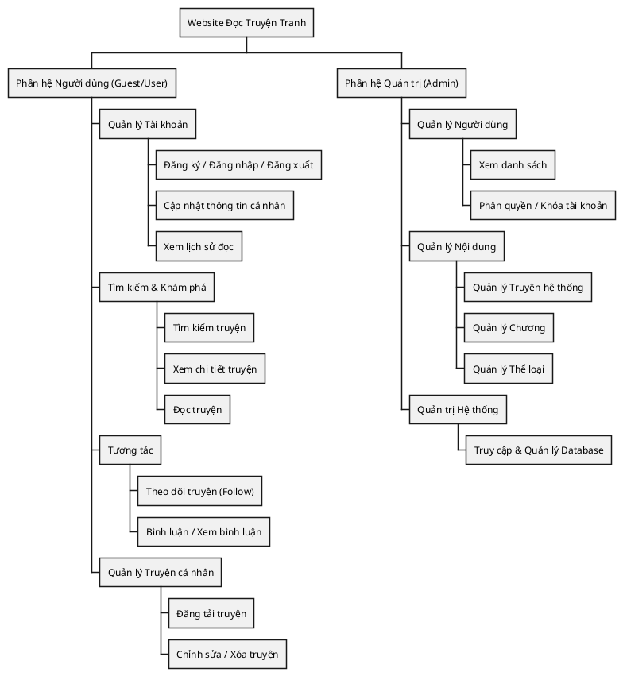

## 2.3. Biểu đồ Use Case Tổng quát (PlantUML)

Dưới đây là biểu đồ Use Case tổng quát mô tả sự tương tác giữa các tác nhân và hệ thống:

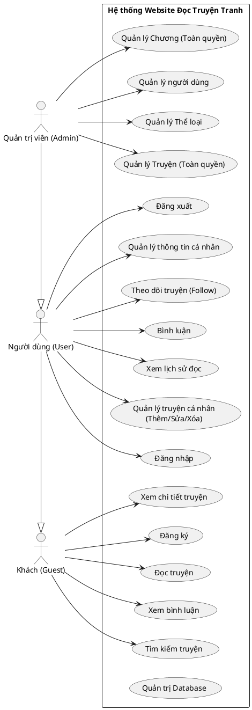
@startwbs
 Website Đọc Truyện Tranh
 Phân hệ Người dùng (Guest/User)
 Quản lý Tài khoản
 Đăng ký / Đăng nhập / Đăng xuất
 Cập nhật thông tin cá nhân
 Xem lịch sử đọc
 Tìm kiếm & Khám phá
 Tìm kiếm truyện
 Xem chi tiết truyện
 Đọc truyện
 Tương tác
 Theo dõi truyện (Follow)
 Bình luận / Xem bình luận
 Quản lý Truyện cá nhân
 Đăng tải truyện
 Chỉnh sửa / Xóa truyện
 Phân hệ Quản trị (Admin)
 Quản lý Người dùng
 Xem danh sách
 Phân quyền / Khóa tài khoản
 Quản lý Nội dung
 Quản lý Truyện hệ thống
 Quản lý Chương
 Quản lý Thể loại
 Quản trị Hệ thống
 Truy cập & Quản lý Database
@endwbs
```

## 2.3. Biểu đồ Use Case Tổng quát (PlantUML)

Dưới đây là biểu đồ Use Case tổng quát mô tả sự tương tác giữa các tác nhân và hệ thống:

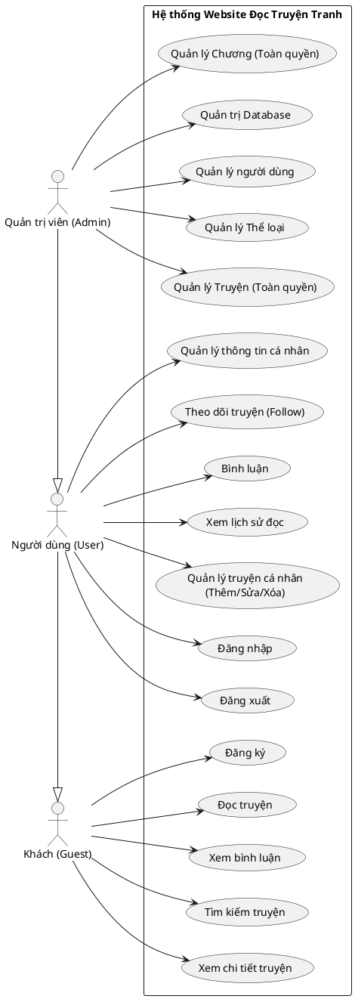

## 2.4. Biểu đồ Use Case phân rã (PlantUML)

Để làm rõ hơn các nhóm chức năng, hệ thống được phân rã thành các biểu đồ Use Case con như sau:

### 2.4.1. Nhóm chức năng Quản lý Tài khoản (Authentication)

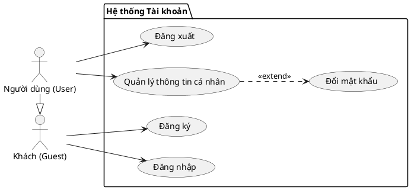

### 2.4.2. Nhóm chức năng Khai thác nội dung & Tương tác

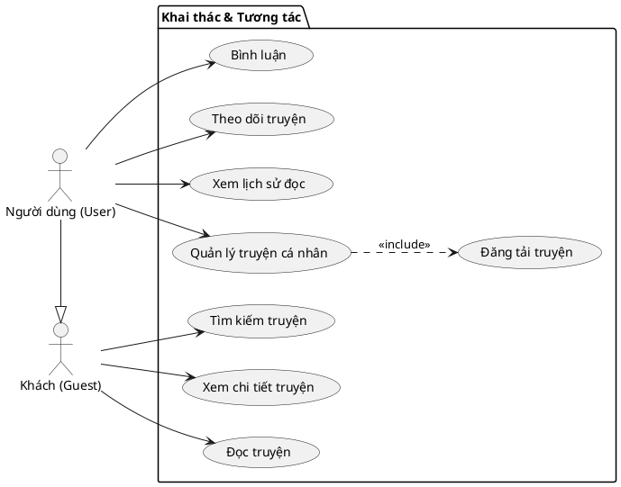

### 2.4.3. Nhóm chức năng Quản trị (Admin)

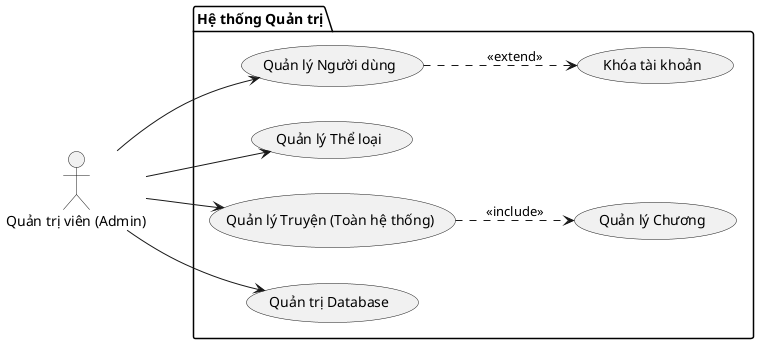

## 2.5. Đặc tả Use Case

Dưới đây là bảng đặc tả chi tiết cho toàn bộ các Use Case của hệ thống:

### 2.5.1. Nhóm Use Case cho Khách/Người dùng

**1. Đặc tả Use Case: Đăng ký**

| Mục | Nội dung |
| :--- | :--- |
| **Tên Use Case** | Đăng ký |
| **Tác nhân** | Khách |
| **Mô tả** | Người dùng tạo tài khoản mới để tham gia hệ thống. |
| **Tiền điều kiện** | Người dùng chưa có tài khoản hoặc chưa đăng nhập. |
| **Dòng sự kiện chính** | 1. Người dùng chọn chức năng "Đăng ký".<br>2. Hệ thống hiển thị form nhập (Email, Mật khẩu, Nhập lại mật khẩu).<br>3. Người dùng điền thông tin và xác nhận.<br>4. Hệ thống kiểm tra dữ liệu và tính duy nhất của Email.<br>5. Hệ thống tạo tài khoản mới và thông báo thành công. |
| **Dòng sự kiện phụ** | 4a. Email đã tồn tại hoặc mật khẩu không khớp:<br> - Hệ thống báo lỗi tương ứng.<br> - Yêu cầu nhập lại. |

**2. Đặc tả Use Case: Đăng nhập**

| Mục | Nội dung |
| :--- | :--- |
| **Tên Use Case** | Đăng nhập |
| **Tác nhân** | Khách, Người dùng, Admin |
| **Mô tả** | Xác thực danh tính để truy cập hệ thống. |
| **Tiền điều kiện** | Có tài khoản và chưa đăng nhập. |
| **Dòng sự kiện chính** | 1. Người dùng chọn "Đăng nhập".<br>2. Nhập Email và Mật khẩu.<br>3. Hệ thống xác thực thông tin.<br>4. Đăng nhập thành công, chuyển hướng về trang chủ. |
| **Dòng sự kiện phụ** | 3a. Thông tin sai:<br> - Báo lỗi đăng nhập thất bại. |

**3. Đặc tả Use Case: Đăng xuất**

| Mục | Nội dung |
| :--- | :--- |
| **Tên Use Case** | Đăng xuất |
| **Tác nhân** | Người dùng, Admin |
| **Mô tả** | Kết thúc phiên làm việc. |
| **Tiền điều kiện** | Đang đăng nhập. |
| **Dòng sự kiện chính** | 1. Người dùng chọn "Đăng xuất".<br>2. Hệ thống xóa phiên làm việc.<br>3. Chuyển hướng về trang chủ ở chế độ Khách. |

**4. Đặc tả Use Case: Tìm kiếm truyện**

| Mục | Nội dung |
| :--- | :--- |
| **Tên Use Case** | Tìm kiếm truyện |
| **Tác nhân** | Tất cả |
| **Mô tả** | Tìm truyện theo từ khóa hoặc bộ lọc. |
| **Tiền điều kiện** | Không có. |
| **Dòng sự kiện chính** | 1. Người dùng nhập từ khóa vào ô tìm kiếm.<br>2. Hệ thống truy vấn database theo tên truyện hoặc tác giả.<br>3. Hiển thị danh sách kết quả phù hợp. |
| **Dòng sự kiện phụ** | 3a. Không tìm thấy kết quả:<br> - Hiển thị thông báo "Không tìm thấy truyện". |

**5. Đặc tả Use Case: Xem chi tiết truyện**

| Mục | Nội dung |
| :--- | :--- |
| ** ** | Xem chi tiết truyện |
| **Tác nhân** | Tất cả |
| **Mô tả** | Xem thông tin đầy đủ của một bộ truyện. |
| **Tiền điều kiện** | Chọn truyện từ danh sách. |
| **Dòng sự kiện chính** | 1. Người dùng click vào ảnh bìa hoặc tên truyện.<br>2. Hệ thống hiển thị: Tên, Tác giả, Thể loại, Tóm tắt, Danh sách chương.<br>3. Người dùng xem thông tin. |

**6. Đặc tả Use Case: Đọc truyện**

| Mục | Nội dung |
| :--- | :--- |
| **Tên Use Case** | Đọc truyện |
| **Tác nhân** | Tất cả |
| **Mô tả** | Xem nội dung các chương truyện. |
| **Tiền điều kiện** | Chọn chương truyện muốn đọc. |
| **Dòng sự kiện chính** | 1. Người dùng chọn chương.<br>2. Hệ thống tải danh sách ảnh của chương.<br>3. Hiển thị ảnh truyện theo thứ tự.<br>4. (Nếu là User) Lưu lịch sử đọc. |

**7. Đặc tả Use Case: Xem bình luận**

| Mục | Nội dung |
| :--- | :--- |
| **Tên Use Case** | Xem bình luận |
| **Tác nhân** | Tất cả |
| **Mô tả** | Xem ý kiến thảo luận của người khác. |
| **Tiền điều kiện** | Đang ở trang chi tiết truyện hoặc trang đọc. |
| **Dòng sự kiện chính** | 1. Hệ thống hiển thị danh sách bình luận phía dưới.<br>2. Người dùng xem nội dung. |

**8. Đặc tả Use Case: Quản lý thông tin cá nhân**

| Mục | Nội dung |
| :--- | :--- |
| **Tên Use Case** | Quản lý thông tin cá nhân |
| **Tác nhân** | Người dùng, Admin |
| **Mô tả** | Xem và cập nhật profile. |
| **Tiền điều kiện** | Đã đăng nhập. |
| **Dòng sự kiện chính** | 1. Vào trang "Hồ sơ".<br>2. Chỉnh sửa thông tin (Tên, Ảnh đại diện) hoặc đổi mật khẩu.<br>3. Lưu thay đổi.<br>4. Hệ thống cập nhật và thông báo. |

**9. Đặc tả Use Case: Theo dõi truyện (Follow)**

| Mục | Nội dung |
| :--- | :--- |
| **Tên Use Case** | Theo dõi truyện |
| **Tác nhân** | Người dùng, Admin |
| **Mô tả** | Lưu truyện vào danh sách yêu thích. |
| **Tiền điều kiện** | Đã đăng nhập. |
| **Dòng sự kiện chính** | 1. Tại trang truyện, nhấn nút "Theo dõi".<br>2. Hệ thống thêm truyện vào bảng Theo dõi của user.<br>3. Nút chuyển trạng thái sang "Đang theo dõi". |

**10. Đặc tả Use Case: Bình luận**

| Mục | Nội dung |
| :--- | :--- |
| **Tên Use Case** | Bình luận |
| **Tác nhân** | Người dùng, Admin |
| **Mô tả** | Gửi bình luận mới. |
| **Tiền điều kiện** | Đã đăng nhập. |
| **Dòng sự kiện chính** | 1. Nhập nội dung vào ô bình luận.<br>2. Nhấn Gửi.<br>3. Hệ thống lưu bình luận và hiển thị ngay lập tức lên danh sách. |

**11. Đặc tả Use Case: Xem lịch sử đọc**

| Mục | Nội dung |
| :--- | :--- |
| **Tên Use Case** | Xem lịch sử đọc |
| **Tác nhân** | Người dùng |
| **Mô tả** | Xem lại các truyện đã đọc. |
| **Tiền điều kiện** | Đã đăng nhập. |
| **Dòng sự kiện chính** | 1. Vào trang "Lịch sử".<br>2. Hệ thống truy vấn các chương đã đọc gần nhất.<br>3. Hiển thị danh sách sắp xếp theo thời gian đọc. |

**12. Đặc tả Use Case: Quản lý truyện cá nhân**

| Mục | Nội dung |
| :--- | :--- |
| **Tên Use Case** | Quản lý truyện cá nhân |
| **Tác nhân** | Người dùng |
| **Mô tả** | Đăng/Sửa/Xóa truyện do mình tạo. |
| **Tiền điều kiện** | Đã đăng nhập. |
| **Dòng sự kiện chính** | 1. Vào trang quản lý truyện.<br>2. Chọn "Thêm mới" hoặc chọn truyện có sẵn để Sửa/Xóa.<br>3. Thực hiện thao tác.<br>4. Hệ thống cập nhật database. |

### 2.5.2. Nhóm Use Case Quản trị (Admin)

**13. Đặc tả Use Case: Quản lý người dùng**

| Mục | Nội dung |
| :--- | :--- |
| **Tên Use Case** | Quản lý người dùng |
| **Tác nhân** | Admin |
| **Mô tả** | Quản lý danh sách thành viên. |
| **Tiền điều kiện** | Admin login. |
| **Dòng sự kiện chính** | 1. Admin xem danh sách user.<br>2. Tìm kiếm user theo email/tên.<br>3. Thực hiện khóa hoặc mở khóa tài khoản.<br>4. Hệ thống cập nhật trạng thái user. |

**14. Đặc tả Use Case: Quản lý Thể loại**

| Mục | Nội dung |
| :--- | :--- |
| **Tên Use Case** | Quản lý Thể loại |
| **Tác nhân** | Admin |
| **Mô tả** | Thêm/Xóa/Sửa danh mục thể loại. |
| **Tiền điều kiện** | Admin login. |
| **Dòng sự kiện chính** | 1. Vào trang quản lý thể loại.<br>2. Nhập tên thể loại mới và Thêm.<br>3. Hoặc chọn thể loại cũ để Sửa tên/Xóa.<br>4. Hệ thống cập nhật bảng Genres. |

**15. Đặc tả Use Case: Quản lý Truyện (Toàn quyền)**

| Mục | Nội dung |
| :--- | :--- |
| **Tên Use Case** | Quản lý Truyện |
| **Tác nhân** | Admin |
| **Mô tả** | Can thiệp vào mọi truyện trên hệ thống. |
| **Tiền điều kiện** | Admin login. |
| **Dòng sự kiện chính** | 1. Admin tìm kiếm truyện bất kỳ.<br>2. Có thể Sửa thông tin, Ẩn truyện (nếu vi phạm), hoặc Xóa vĩnh viễn.<br>3. Cập nhật database. |

**16. Đặc tả Use Case: Quản lý Chương (Toàn quyền)**

| Mục | Nội dung |
| :--- | :--- |
| **Tên Use Case** | Quản lý Chương |
| **Tác nhân** | Admin |
| **Mô tả** | Quản lý nội dung chương của mọi truyện. |
| **Tiền điều kiện** | Admin login. |
| **Dòng sự kiện chính** | 1. Chọn truyện cần quản lý.<br>2. Thêm chương mới (upload ảnh), Sửa lại thứ tự ảnh, hoặc Xóa chương.<br>3. Hệ thống xử lý file và cập nhật DB. |
### 2.4.3. Nhóm chức năng Quản trị (Admin)


## 2.5. Đặc tả Use Case

Dưới đây là bảng đặc tả chi tiết cho toàn bộ các Use Case của hệ thống:

### 2.5.1. Nhóm Use Case cho Khách/Người dùng

**1. Đặc tả Use Case: Đăng ký**

| Mục | Nội dung |
| :--- | :--- |
| **Tên Use Case** | Đăng ký |
| **Tác nhân** | Khách |
| **Mô tả** | Người dùng tạo tài khoản mới để tham gia hệ thống. |
| **Tiền điều kiện** | Người dùng chưa có tài khoản hoặc chưa đăng nhập. |
| **Dòng sự kiện chính** | 1. Người dùng chọn chức năng "Đăng ký".<br>2. Hệ thống hiển thị form nhập (Email, Mật khẩu, Nhập lại mật khẩu).<br>3. Người dùng điền thông tin và xác nhận.<br>4. Hệ thống kiểm tra dữ liệu và tính duy nhất của Email.<br>5. Hệ thống tạo tài khoản mới và thông báo thành công. |
| **Dòng sự kiện phụ** | 4a. Email đã tồn tại hoặc mật khẩu không khớp:<br> - Hệ thống báo lỗi tương ứng.<br> - Yêu cầu nhập lại. |

**2. Đặc tả Use Case: Đăng nhập**

| Mục | Nội dung |
| :--- | :--- |
| **Tên Use Case** | Đăng nhập |
| **Tác nhân** | Khách, Người dùng, Admin |
| **Mô tả** | Xác thực danh tính để truy cập hệ thống. |
| **Tiền điều kiện** | Có tài khoản và chưa đăng nhập. |
| **Dòng sự kiện chính** | 1. Người dùng chọn "Đăng nhập".<br>2. Nhập Email và Mật khẩu.<br>3. Hệ thống xác thực thông tin.<br>4. Đăng nhập thành công, chuyển hướng về trang chủ. |
| **Dòng sự kiện phụ** | 3a. Thông tin sai:<br> - Báo lỗi đăng nhập thất bại. |

**3. Đặc tả Use Case: Đăng xuất**

| Mục | Nội dung |
| :--- | :--- |
| **Tên Use Case** | Đăng xuất |
| **Tác nhân** | Người dùng, Admin |
| **Mô tả** | Kết thúc phiên làm việc. |
| **Tiền điều kiện** | Đang đăng nhập. |
| **Dòng sự kiện chính** | 1. Người dùng chọn "Đăng xuất".<br>2. Hệ thống xóa phiên làm việc.<br>3. Chuyển hướng về trang chủ ở chế độ Khách. |

**4. Đặc tả Use Case: Tìm kiếm truyện**

| Mục | Nội dung |
| :--- | :--- |
| **Tên Use Case** | Tìm kiếm truyện |
| **Tác nhân** | Tất cả |
| **Mô tả** | Tìm truyện theo từ khóa hoặc bộ lọc. |
| **Tiền điều kiện** | Không có. |
| **Dòng sự kiện chính** | 1. Người dùng nhập từ khóa vào ô tìm kiếm.<br>2. Hệ thống truy vấn database theo tên truyện hoặc tác giả.<br>3. Hiển thị danh sách kết quả phù hợp. |
| **Dòng sự kiện phụ** | 3a. Không tìm thấy kết quả:<br> - Hiển thị thông báo "Không tìm thấy truyện". |

**5. Đặc tả Use Case: Xem chi tiết truyện**

| Mục | Nội dung |
| :--- | :--- |
| ** ** | Xem chi tiết truyện |
| **Tác nhân** | Tất cả |
| **Mô tả** | Xem thông tin đầy đủ của một bộ truyện. |
| **Tiền điều kiện** | Chọn truyện từ danh sách. |
| **Dòng sự kiện chính** | 1. Người dùng click vào ảnh bìa hoặc tên truyện.<br>2. Hệ thống hiển thị: Tên, Tác giả, Thể loại, Tóm tắt, Danh sách chương.<br>3. Người dùng xem thông tin. |

**6. Đặc tả Use Case: Đọc truyện**

| Mục | Nội dung |
| :--- | :--- |
| **Tên Use Case** | Đọc truyện |
| **Tác nhân** | Tất cả |
| **Mô tả** | Xem nội dung các chương truyện. |
| **Tiền điều kiện** | Chọn chương truyện muốn đọc. |
| **Dòng sự kiện chính** | 1. Người dùng chọn chương.<br>2. Hệ thống tải danh sách ảnh của chương.<br>3. Hiển thị ảnh truyện theo thứ tự.<br>4. (Nếu là User) Lưu lịch sử đọc. |

**7. Đặc tả Use Case: Xem bình luận**

| Mục | Nội dung |
| :--- | :--- |
| **Tên Use Case** | Xem bình luận |
| **Tác nhân** | Tất cả |
| **Mô tả** | Xem ý kiến thảo luận của người khác. |
| **Tiền điều kiện** | Đang ở trang chi tiết truyện hoặc trang đọc. |
| **Dòng sự kiện chính** | 1. Hệ thống hiển thị danh sách bình luận phía dưới.<br>2. Người dùng xem nội dung. |

**8. Đặc tả Use Case: Quản lý thông tin cá nhân**

| Mục | Nội dung |
| :--- | :--- |
| **Tên Use Case** | Quản lý thông tin cá nhân |
| **Tác nhân** | Người dùng, Admin |
| **Mô tả** | Xem và cập nhật profile. |
| **Tiền điều kiện** | Đã đăng nhập. |
| **Dòng sự kiện chính** | 1. Vào trang "Hồ sơ".<br>2. Chỉnh sửa thông tin (Tên, Ảnh đại diện) hoặc đổi mật khẩu.<br>3. Lưu thay đổi.<br>4. Hệ thống cập nhật và thông báo. |

**9. Đặc tả Use Case: Theo dõi truyện (Follow)**

| Mục | Nội dung |
| :--- | :--- |
| **Tên Use Case** | Theo dõi truyện |
| **Tác nhân** | Người dùng, Admin |
| **Mô tả** | Lưu truyện vào danh sách yêu thích. |
| **Tiền điều kiện** | Đã đăng nhập. |
| **Dòng sự kiện chính** | 1. Tại trang truyện, nhấn nút "Theo dõi".<br>2. Hệ thống thêm truyện vào bảng Theo dõi của user.<br>3. Nút chuyển trạng thái sang "Đang theo dõi". |

**10. Đặc tả Use Case: Bình luận**

| Mục | Nội dung |
| :--- | :--- |
| **Tên Use Case** | Bình luận |
| **Tác nhân** | Người dùng, Admin |
| **Mô tả** | Gửi bình luận mới. |
| **Tiền điều kiện** | Đã đăng nhập. |
| **Dòng sự kiện chính** | 1. Nhập nội dung vào ô bình luận.<br>2. Nhấn Gửi.<br>3. Hệ thống lưu bình luận và hiển thị ngay lập tức lên danh sách. |

**11. Đặc tả Use Case: Xem lịch sử đọc**

| Mục | Nội dung |
| :--- | :--- |
| **Tên Use Case** | Xem lịch sử đọc |
| **Tác nhân** | Người dùng |
| **Mô tả** | Xem lại các truyện đã đọc. |
| **Tiền điều kiện** | Đã đăng nhập. |
| **Dòng sự kiện chính** | 1. Vào trang "Lịch sử".<br>2. Hệ thống truy vấn các chương đã đọc gần nhất.<br>3. Hiển thị danh sách sắp xếp theo thời gian đọc. |

**12. Đặc tả Use Case: Quản lý truyện cá nhân**

| Mục | Nội dung |
| :--- | :--- |
| **Tên Use Case** | Quản lý truyện cá nhân |
| **Tác nhân** | Người dùng |
| **Mô tả** | Đăng/Sửa/Xóa truyện do mình tạo. |
| **Tiền điều kiện** | Đã đăng nhập. |
| **Dòng sự kiện chính** | 1. Vào trang quản lý truyện.<br>2. Chọn "Thêm mới" hoặc chọn truyện có sẵn để Sửa/Xóa.<br>3. Thực hiện thao tác.<br>4. Hệ thống cập nhật database. |

### 2.5.2. Nhóm Use Case Quản trị (Admin)

**13. Đặc tả Use Case: Quản lý người dùng**

| Mục | Nội dung |
| :--- | :--- |
| **Tên Use Case** | Quản lý người dùng |
| **Tác nhân** | Admin |
| **Mô tả** | Quản lý danh sách thành viên. |
| **Tiền điều kiện** | Admin login. |
| **Dòng sự kiện chính** | 1. Admin xem danh sách user.<br>2. Tìm kiếm user theo email/tên.<br>3. Thực hiện khóa hoặc mở khóa tài khoản.<br>4. Hệ thống cập nhật trạng thái user. |

**14. Đặc tả Use Case: Quản lý Thể loại**

| Mục | Nội dung |
| :--- | :--- |
| **Tên Use Case** | Quản lý Thể loại |
| **Tác nhân** | Admin |
| **Mô tả** | Thêm/Xóa/Sửa danh mục thể loại. |
| **Tiền điều kiện** | Admin login. |
| **Dòng sự kiện chính** | 1. Vào trang quản lý thể loại.<br>2. Nhập tên thể loại mới và Thêm.<br>3. Hoặc chọn thể loại cũ để Sửa tên/Xóa.<br>4. Hệ thống cập nhật bảng Genres. |

**15. Đặc tả Use Case: Quản lý Truyện (Toàn quyền)**

| Mục | Nội dung |
| :--- | :--- |
| **Tên Use Case** | Quản lý Truyện |
| **Tác nhân** | Admin |
| **Mô tả** | Can thiệp vào mọi truyện trên hệ thống. |
| **Tiền điều kiện** | Admin login. |
| **Dòng sự kiện chính** | 1. Admin tìm kiếm truyện bất kỳ.<br>2. Có thể Sửa thông tin, Ẩn truyện (nếu vi phạm), hoặc Xóa vĩnh viễn.<br>3. Cập nhật database. |

**16. Đặc tả Use Case: Quản lý Chương (Toàn quyền)**

| Mục | Nội dung |
| :--- | :--- |
| **Tên Use Case** | Quản lý Chương |
| **Tác nhân** | Admin |
| **Mô tả** | Quản lý nội dung chương của mọi truyện. |
| **Tiền điều kiện** | Admin login. |
| **Dòng sự kiện chính** | 1. Chọn truyện cần quản lý.<br>2. Thêm chương mới (upload ảnh), Sửa lại thứ tự ảnh, hoặc Xóa chương.<br>3. Hệ thống xử lý file và cập nhật DB. |

**17. Đặc tả Use Case: Quản trị Database**

| Mục | Nội dung |
| :--- | :--- |
| **Tên Use Case** | Quản trị Database |
| **Tác nhân** | Admin |
| **Mô tả** | Truy cập trực tiếp DB để bảo trì. |
| **Tiền điều kiện** | Có tài khoản Supabase hoặc quyền truy cập trực tiếp. |
| **Dòng sự kiện chính** | 1. Admin đăng nhập vào công cụ quản trị DB (Supabase Dashboard).<br>2. Thực hiện các câu lệnh SQL hoặc thao tác UI để sửa lỗi dữ liệu cấp thấp.<br>3. Lưu thay đổi. |

## 2.6. Biểu đồ hoạt động (Activity Diagram)

Một số biểu đồ hoạt động mô tả quy trình nghiệp vụ chính:

### 2.6.1. Biểu đồ hoạt động cho Use Case "Đăng nhập"

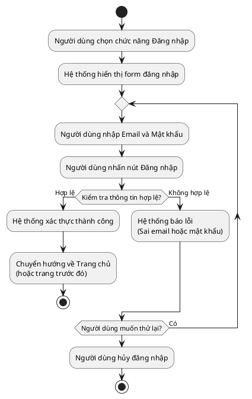

### 2.6.2. Biểu đồ hoạt động cho Use Case "Đăng ký"

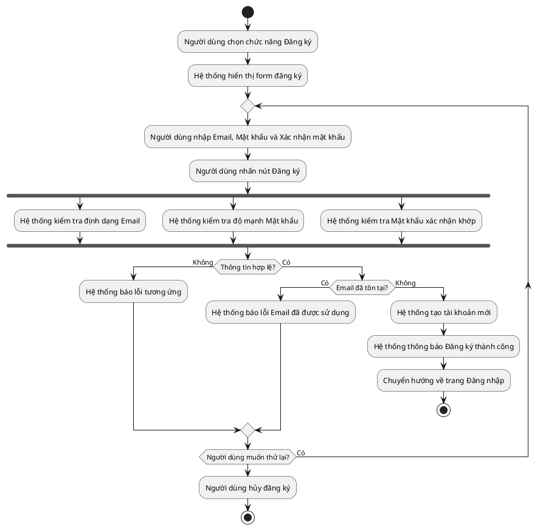

### 2.6.3. Biểu đồ hoạt động cho Use Case "Đăng tải truyện mới"

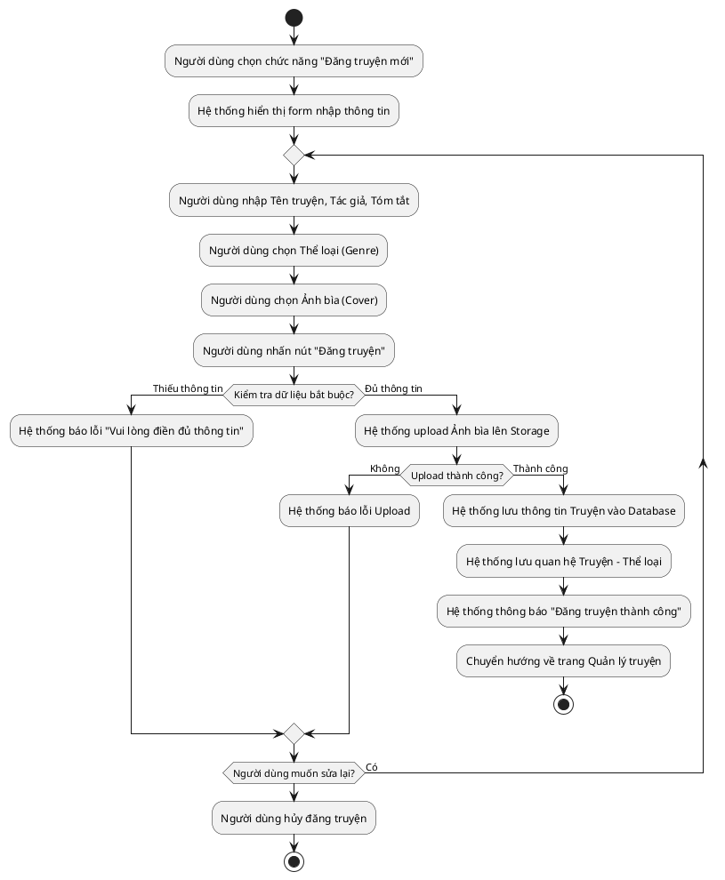

### 2.6.4. Biểu đồ hoạt động cho Use Case "Đăng chương mới"

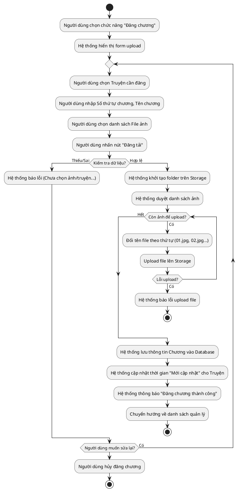

### 2.6.5. Biểu đồ hoạt động cho Use Case "Sửa/Xóa Truyện"

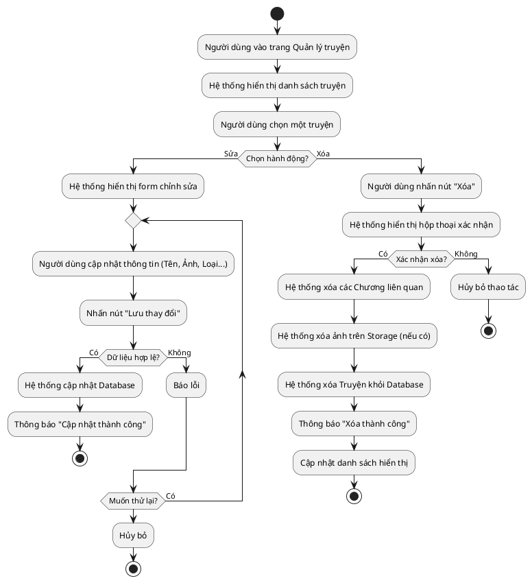

### 2.6.6. Biểu đồ hoạt động cho Use Case "Sửa thông tin cá nhân"

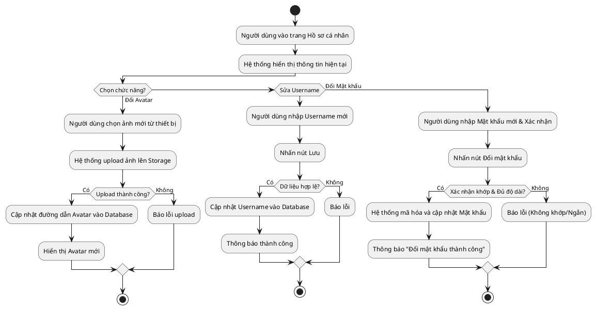

### 2.6.7. Biểu đồ hoạt động cho Use Case "Tìm kiếm truyện"

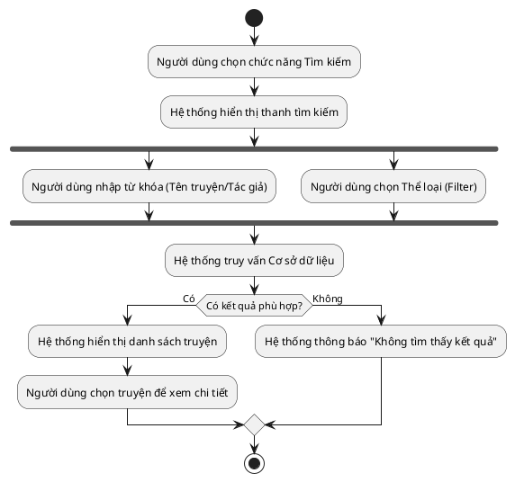

### 2.6.8. Biểu đồ hoạt động cho Use Case "Bình luận"

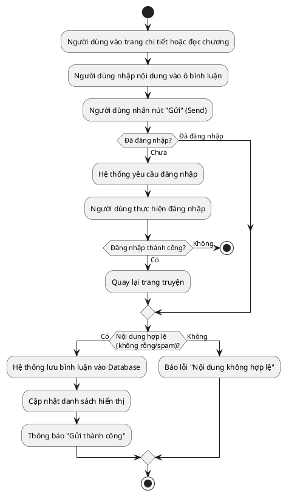

### 2.6.9. Biểu đồ hoạt động cho Use Case "Theo dõi truyện"

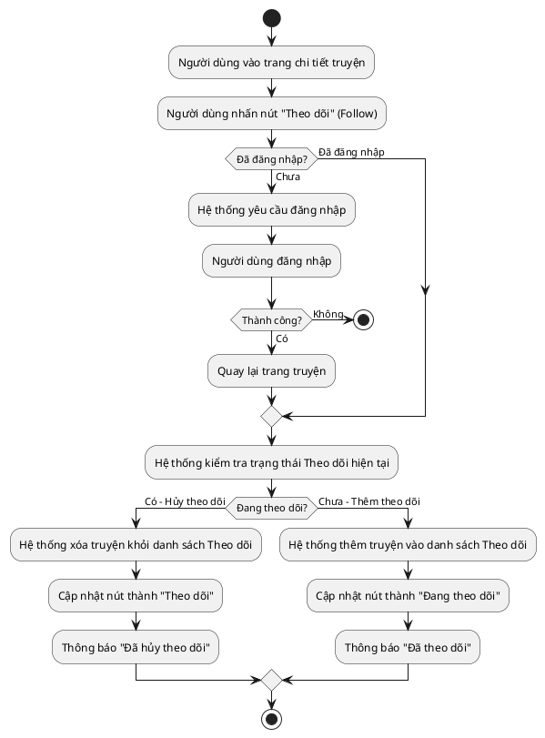
