# CHƯƠNG 3: THIẾT KẾ HỆ THỐNG

## 3.1. Thiết kế Cơ sở dữ liệu (Database Design)

Trước khi đi vào chi tiết các lớp đối tượng, dưới đây là mô hình thực thể kết hợp (ERD - Entity Relationship Diagram) của hệ thống:

Mô tả: Hệ thống sử dụng PostgreSQL thông qua Supabase. Các bảng chính bao gồm Users (auth), Profiles, Mangas, Chapters, Genres, Comments, Follows.

### 3.1.1. Bảng `profiles` (Hồ sơ người dùng)
| STT | Tên thuộc tính | Kiểu dữ liệu | Giải thích | Ghi chú |
|:---:|:---|:---|:---|:---|
| 1 | `id` | UUID | Khóa chính, định danh người dùng | PK, FK (ref `auth.users`) |
| 2 | `username` | Text | Tên hiển thị trên hệ thống | Unique |
| 3 | `avatar_url` | Text | Đường dẫn ảnh đại diện | |

### 3.1.2. Bảng `mangas` (Truyện tranh)
| STT | Tên thuộc tính | Kiểu dữ liệu | Giải thích | Ghi chú |
|:---:|:---|:---|:---|:---|
| 1 | `id` | UUID | Khóa chính, định danh truyện | PK, Default: `uuid_generate_v4()` |
| 2 | `title` | Text | Tên truyện | Not Null |
| 3 | `slug` | Text | Đường dẫn thân thiện (SEO) | Unique, Not Null |
| 4 | `cover_url` | Text | Đường dẫn ảnh bìa | |
| 5 | `author` | Text | Tên tác giả | |
| 6 | `summary` | Text | Tóm tắt nội dung | |
| 7 | `views` | Integer | Tổng lượt xem | Default: 0 |
| 8 | `user_id` | UUID | Người đăng truyện | FK (ref `profiles.id`) |
| 9 | `created_at` | Timestamptz | Thời gian tạo | Default: `now()` |
| 10 | `updated_at` | Timestamptz | Thời gian cập nhật cuối cùng | |

### 3.1.3. Bảng `chapters` (Chương truyện)
| STT | Tên thuộc tính | Kiểu dữ liệu | Giải thích | Ghi chú |
|:---:|:---|:---|:---|:---|
| 1 | `id` | UUID | Khóa chính, định danh chương | PK |
| 2 | `manga_id` | UUID | Thuộc về bộ truyện nào | FK (ref `mangas.id`) |
| 3 | `title` | Text | Tên chương (VD: Chương 1 - Mở đầu) | |
| 4 | `slug` | Text | Đường dẫn thân thiện | |
| 5 | `chapter_number` | Float | Số thứ tự chương | Used for sorting |
| 6 | `images` | JSONB | Danh sách URL các trang truyện | |
| 7 | `created_at` | Timestamptz | Thời gian đăng | Default: `now()` |

### 3.1.4. Bảng `genres` (Thể loại)
| STT | Tên thuộc tính | Kiểu dữ liệu | Giải thích | Ghi chú |
|:---:|:---|:---|:---|:---|
| 1 | `id` | UUID | Khóa chính | PK |
| 2 | `name` | Text | Tên thể loại (Hành động, Tình cảm...) | Unique |
| 3 | `slug` | Text | Slug thể loại | Unique |
| 4 | `created_at` | Timestamptz | Thời gian tạo | |

### 3.1.5. Bảng `manga_genres` (Liên kết Truyện - Thể loại)
| STT | Tên thuộc tính | Kiểu dữ liệu | Giải thích | Ghi chú |
|:---:|:---|:---|:---|:---|
| 1 | `id` | UUID | Khóa chính | PK |
| 2 | `manga_id` | UUID | ID Truyện | FK (ref `mangas.id`) |
| 3 | `genre_id` | UUID | ID Thể loại | FK (ref `genres.id`) |

### 3.1.6. Bảng `comments` (Bình luận)
| STT | Tên thuộc tính | Kiểu dữ liệu | Giải thích | Ghi chú |
|:---:|:---|:---|:---|:---|
| 1 | `id` | UUID | Khóa chính | PK |
| 2 | `user_id` | UUID | Người bình luận | FK (ref `profiles.id`) |
| 3 | `manga_id` | UUID | Bình luận về truyện nào | FK (ref `mangas.id`) |
| 4 | `content` | Text | Nội dung bình luận | Not Null |
| 5 | `created_at` | Timestamptz | Thời gian bình luận | Default: `now()` |

### 3.1.7. Bảng `follows` (Theo dõi)
| STT | Tên thuộc tính | Kiểu dữ liệu | Giải thích | Ghi chú |
|:---:|:---|:---|:---|:---|
| 1 | `id` | UUID | Khóa chính | PK |
| 2 | `user_id` | UUID | Người theo dõi | FK (ref `profiles.id`) |
| 3 | `manga_id` | UUID | Truyện được theo dõi | FK (ref `mangas.id`) |
| 4 | `created_at` | Timestamptz | Thời gian theo dõi | |

### 3.1.8. Bảng `reading_history` (Lịch sử đọc)
| STT | Tên thuộc tính | Kiểu dữ liệu | Giải thích | Ghi chú |
|:---:|:---|:---|:---|:---|
| 1 | `id` | UUID | Khóa chính | PK |
| 2 | `user_id` | UUID | Người đọc | FK (ref `profiles.id`) |
| 3 | `manga_id` | UUID | Truyện đang đọc | FK (ref `mangas.id`) |
| 4 | `chapter_id` | UUID | Chương mới nhất đã đọc | FK (ref `chapters.id`) |
| 5 | `last_read_at` | Timestamptz | Thời gian đọc gần nhất | |

## 3.2. Biểu đồ Lớp (Class Diagram)

Biểu đồ dưới đây mô tả cấu trúc các lớp (Class) trong hệ thống, bao gồm các thuộc tính (Attributes) và phương thức (Methods) chính, cũng như mối quan hệ giữa chúng.

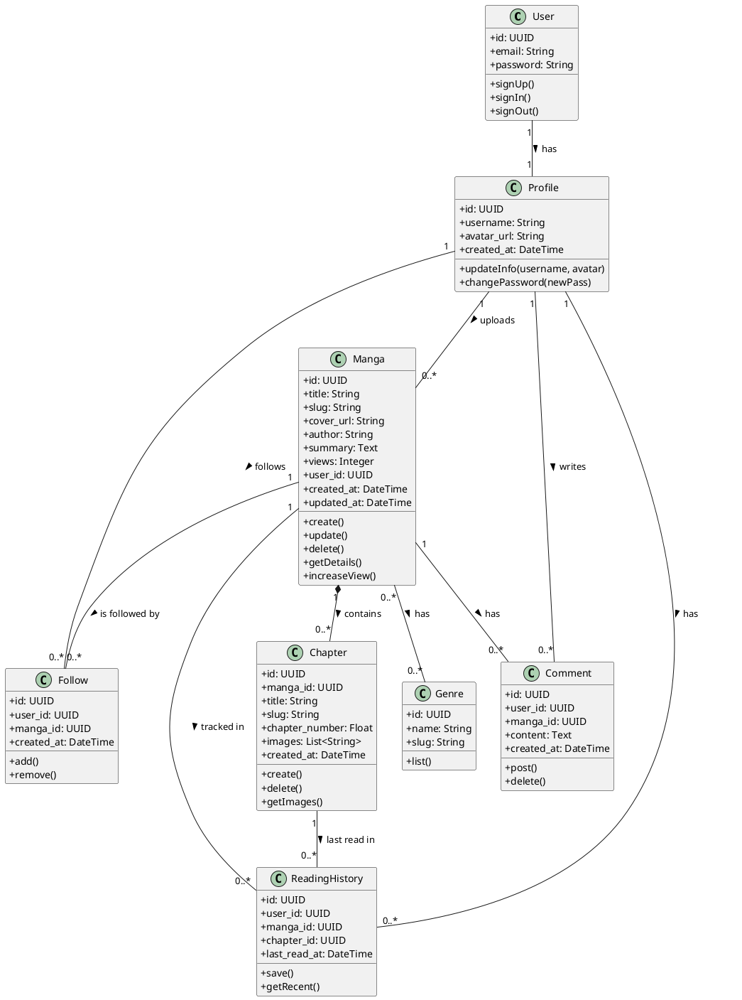

### 3.2.1. Chi tiết các Lớp (Classes Detail)

#### 1. Lớp User (Tài khoản)
   Mô tả: Đại diện cho tài khoản người dùng được quản lý bởi hệ thống xác thực (Supabase Auth).
   Thuộc tính:
       `id`: UUID (Khóa chính).
       `email`: Email đăng nhập.
       `password`: Mật khẩu (đã mã hóa).
   Phương thức:
       `signUp()`: Đăng ký tài khoản mới.
       `signIn()`: Đăng nhập vào hệ thống.
       `signOut()`: Đăng xuất.

#### 2. Lớp Profile (Hồ sơ người dùng)
   Mô tả: Chứa thông tin bổ sung của người dùng, liên kết 1-1 với bảng `users`.
   Thuộc tính:
       `id`: UUID (Khóa chính, trùng với User ID).
       `username`: Tên hiển thị người dùng.
       `avatar_url`: Đường dẫn ảnh đại diện.
   Phương thức:
       `updateInfo()`: Cập nhật tên và ảnh đại diện.
       `changePassword()`: Thay đổi mật khẩu đăng nhập.

#### 3. Lớp Manga (Truyện tranh)
   Mô tả: Đối tượng chính của hệ thống, chứa thông tin về các bộ truyện.
   Thuộc tính:
       `id`: UUID (Khóa chính).
       `title`: Tên truyện.
       `cover_url`: Ảnh bìa.
       `author`: Tên tác giả.
       `views`: Tổng lượt xem.
       `slug`: Đường dẫn thân thiện SEO.
   Phương thức:
       `create()`: Tạo truyện mới.
       `update()`: Cập nhật thông tin truyện.
       `delete()`: Xóa truyện (Soft delete hoặc Hard delete).
       `increaseView()`: Tăng lượt xem khi có người đọc.

#### 4. Lớp Chapter (Chương truyện)
   Mô tả: Các chương thuộc về một bộ truyện cụ thể.
   Thuộc tính:
       `id`: Data ID.
       `manga_id`: Khóa ngoại tham chiếu đến Manga.
       `images`: Danh sách URL các trang truyện (JSON Array).
       `chapter_number`: Số thứ tự chương (VD: 1, 1.5, 2).
   Phương thức:
       `create()`: Đăng chương mới.
       `getImages()`: Lấy danh sách ảnh để hiển thị.

#### 5. Lớp Follow (Theo dõi)
   Mô tả: Lưu trữ trạng thái người dùng theo dõi các bộ truyện.
   Thuộc tính:
       `user_id`: Người theo dõi.
       `manga_id`: Truyện được theo dõi.
   Phương thức:
       `add()`: Thêm vào danh sách theo dõi.
       `remove()`: Hủy theo dõi.

### 3.2.2. Mối quan hệ giữa các lớp (Relationships)

1.  User - Profile (1 - 1):
       Mỗi tài khoản `User` có duy nhất một `Profile` tương ứng để lưu thông tin hiển thị.
2.  Profile - Manga (1 - N):
       Một người dùng (`Profile`) có thể đăng tải nhiều bộ truyện (`Manga`).
       Mỗi bộ truyện thuộc về một người đăng (Uploader).
3.  Manga - Chapter (1 - N - Composition):
       Một bộ truyện gồm nhiều chương.
       Quan hệ Composition (--): Nếu bộ truyện bị xóa, các chương con của nó cũng sẽ bị xóa theo.
4.  Manga - Genre (N - N):
       Một truyện có thể thuộc nhiều thể loại, và một thể loại chứa nhiều truyện.
5.  User - Manga (Follow & Comment & History):
       Người dùng có thể theo dõi (`Follow`), bình luận (`Comment`), và lưu lịch sử đọc (`ReadingHistory`) trên nhiều bộ truyện khác nhau.

## 3.3. Biểu đồ Trạng thái (State Diagram)

Dưới đây là các biểu đồ trạng thái mô tả vòng đời của các đối tượng chính trong hệ thống.

### 3.3.1. Biểu đồ trạng thái của Truyện (Manga)

Mô tả các trạng thái của một bộ truyện từ khi được tạo cho đến khi hoàn thành hoặc bị xóa.

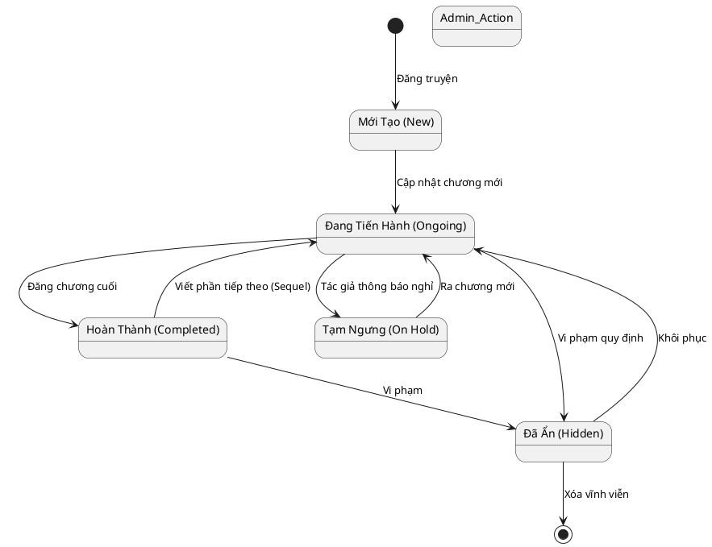

### 3.3.2. Biểu đồ trạng thái của Tài khoản (User Account)

Mô tả các trạng thái hoạt động của tài khoản người dùng trên hệ thống.

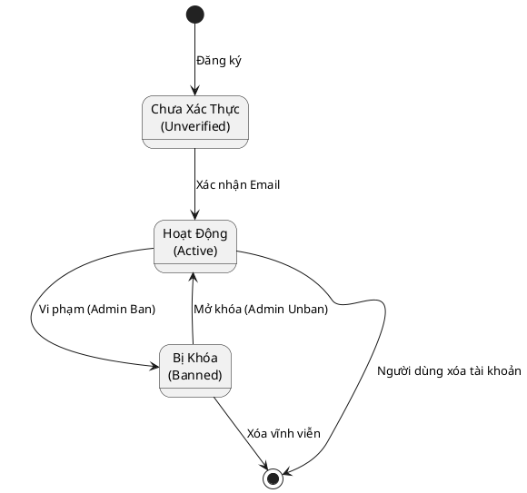

### 3.3.3. Biểu đồ trạng thái của Chương truyện (Chapter)

Mô tả quá trình xử lý một chương truyện khi đăng tải.

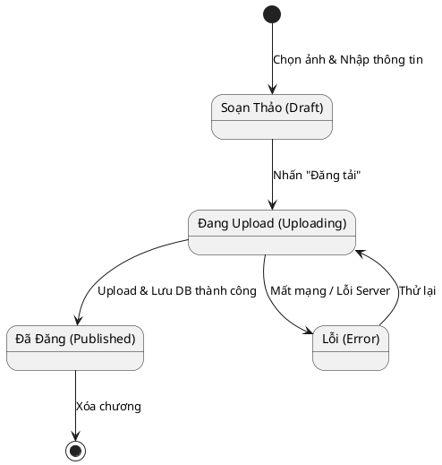

### Giải thích các lớp chính:

1.  User: Đại diện cho tài khoản xác thực (Auth User).
2.  Profile: Thông tin mở rộng của người dùng (tên hiển thị, avatar).
3.  Manga: Đối tượng truyện tranh, chứa thông tin cơ bản và thống kê.
4.  Chapter: Các chương của truyện, chứa danh sách ảnh.
5.  Genre: Thể loại truyện.
6.  Comment: Bình luận của người dùng.
7.  Follow: Quan hệ theo dõi giữa người dùng và truyện.
8.  ReadingHistory: Lưu vết đọc truyện của người dùng.

## 3.4. Biểu đồ Trình tự (Sequence Diagram)

Dưới đây là các biểu đồ trình tự mô tả tương tác giữa Người dùng (Actor), Giao diện (VIew), Controller và Database.

### 3.4.1. Đăng ký & Đăng nhập

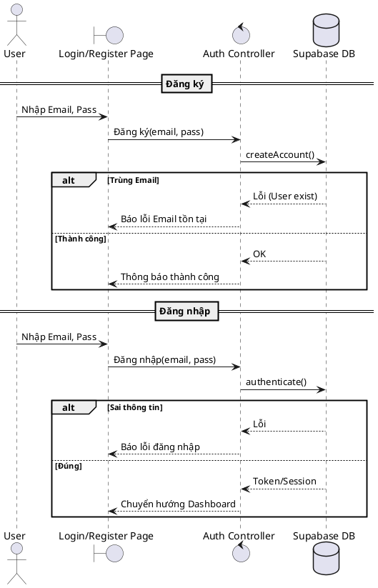

### 3.4.2. Tìm kiếm Truyện

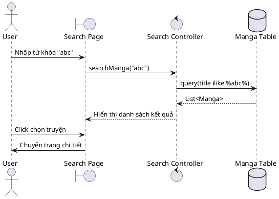

### 3.4.3. Đọc Truyện (Load Chương)

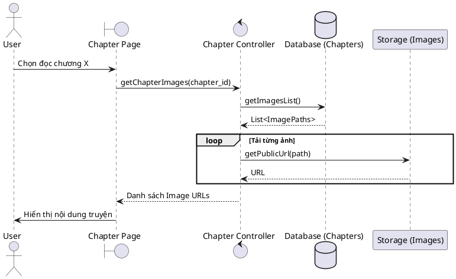

### 3.4.4. Đăng Bình luận

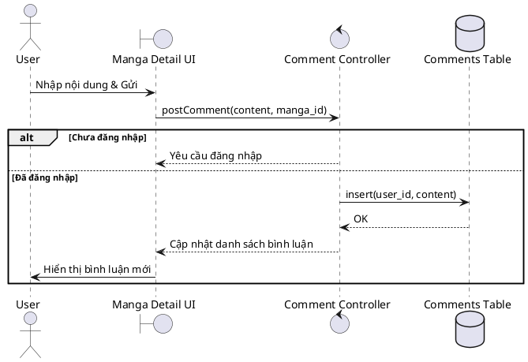

### 3.4.5. Đăng Chương mới (Upload)

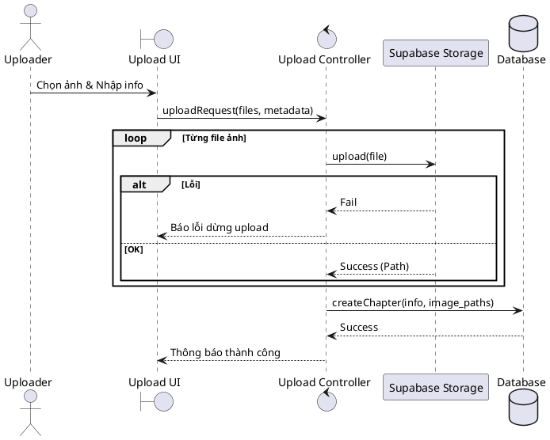

### 3.4.6. Theo dõi Truyện

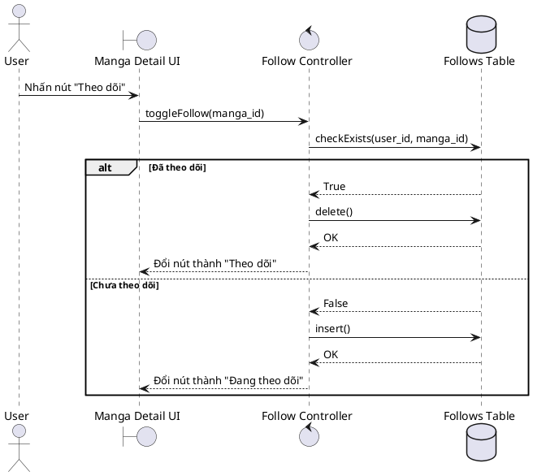

## 3.4. Biểu đồ Trình tự (Sequence Diagram)

Dưới đây là các biểu đồ trình tự mô tả tương tác giữa Người dùng (Actor), Giao diện (VIew), Controller và Database.

### 3.4.1. Đăng ký & Đăng nhập

### 3.4.2. Tìm kiếm Truyện

### 3.4.3. Đọc Truyện (Load Chương)

### 3.4.4. Đăng Bình luận

### 3.4.5. Đăng Chương mới (Upload)

### 3.4.6. Theo dõi Truyện

## 3.5. Biểu đồ Thành phần (Component Diagram)

Biểu đồ này mô tả các thành phần phần mềm chính và sự phụ thuộc giữa chúng.

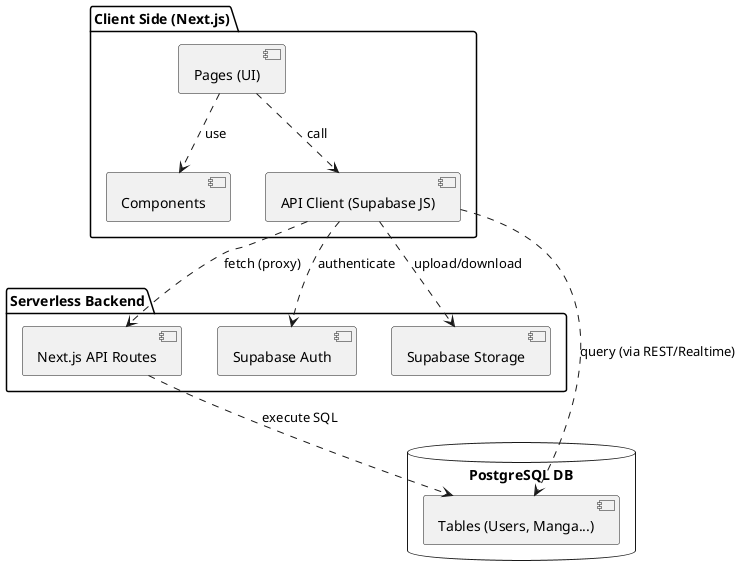

## 3.6. Biểu đồ Triển khai (Deployment Diagram)

Biểu đồ mô tả kiến trúc phần cứng và môi trường triển khai của hệ thống.

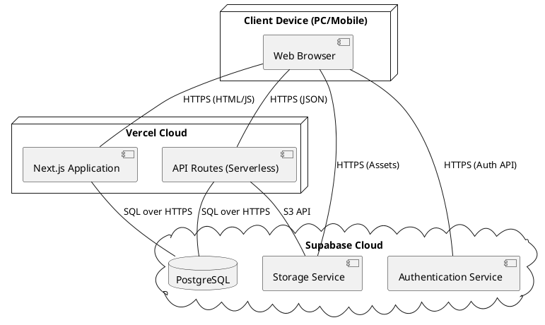

## 3.7. Thiết kế Giao diện (User Interface Design)

Mô tả chi tiết các trang giao diện chính của hệ thống.

### 3.7.1. Trang Chủ (Homepage)
   Mục đích: Là trang đích chính, giới thiệu các truyện nổi bật và điều hướng người dùng.
   Thành phần chính:
       Thanh điều hướng (Navbar): Logo, Tìm kiếm (Search Bar), Danh mục thể loại, Nút Đăng nhập/Đăng ký hoặc Avatar User.
       Banner/Hero Section: Slide ảnh bìa các truyện "Hot" nhất, kèm nút "Đọc ngay".
       Danh sách Truyện Nổi bật: Grid hiển thị Top truyện theo lượt xem (Ảnh bìa, Tên, Badge Rank).
       Danh sách Mới cập nhật: Lưới các truyện vừa có chương mới, sắp xếp theo thời gian giảm dần.
       Footer: Thông tin bản quyền, liên hệ.

### 3.7.2. Trang Chi tiết Truyện (Manga Detail)
   Mục đích: Cung cấp đầy đủ thông tin về một bộ truyện và danh sách chương.
   Thành phần chính:
       Info Block: Ảnh bìa lớn, Tên truyện, Tác giả, Tình trạng, Thể loại (Tags), Tóm tắt nội dung.
       Action Buttons: Nút "Đọc từ đầu", "Đọc mới nhất", "Theo dõi" (Toggle Button).
       Danh sách Chương: Bảng liệt kê các chương (Số chương, Tên chương, Ngày đăng, Lượt xem), có phân trang hoặc cuộn.
       Bình luận: Khu vực cho phép người dùng viết và xem bình luận.

### 3.7.3. Trang Đọc Truyện (Reader)
   Mục đích: Hiển thị nội dung truyện (ảnh) cho người đọc.
   Thành phần chính:
       Sticky Control Bar: Thanh công cụ cố định (hoặc ẩn hiện khi scroll) chứa: Tên truyện, Dropdown chọn chương, Nút Trước/Sau (Prev/Next), Nút Home, Cài đặt hiển thị (nếu có).
       Image Viewer: Danh sách ảnh truyện hiển thị dọc (Webtoon style) hoặc từng trang, tải dạng Lazy Load.
       Navigation Bottom: Nút điều hướng cuối trang để chuyển sang chương tiếp theo.

### 3.7.4. Trang Tìm kiếm & Lọc (Search & Filter)
   Mục đích: Giúp người dùng tìm truyện theo từ khóa hoặc tiêu chí.
   Thành phần chính:
       Thanh tìm kiếm nâng cao: Input nhập từ khóa.
       Bộ lọc (Filter): Checkbox/Dropdown chọn Thể loại (Action, Romance...), Trạng thái (Hoàn thành/Đang tiến hành), Sắp xếp (View/New).
       Kết quả: Grid danh sách truyện thỏa mãn điều kiện.

### 3.7.5. Dashboard Quản lý (User/Admin Dashboard)
   Mục đích: Khu vực quản trị dành cho người dùng có quyền đăng truyện.
   Thành phần chính:
       Sidebar: Menu chức năng (Thống kê, Quản lý Truyện, Đăng truyện, Cài đặt).
       Overview Stats: Cards hiển thị Tổng view, Tổng truyện, Tổng follow.
       Biểu đồ: Bar Chart thống kê lượt xem theo thời gian hoặc theo truyện.
       Danh sách Truyện của tôi: Bảng quản lý (CRUD) các truyện đã đăng, kèm nút Sửa/Xóa/Thêm chương.

### 3.7.6. Trang Hồ sơ & Cài đặt (Profile & Settings)
   Mục đích: Quản lý thông tin cá nhân.
   Thành phần chính:
       Profile Info: Avatar (cho phép upload thay đổi), Username (cho phép sửa), Email (read-only).
       Đổi mật khẩu: Form nhập Mật khẩu cũ/mới để thay đổi.
       Tủ truyện: Tab hiển thị "Truyện đang theo dõi" và "Lịch sử đọc".

### 3.7.7. Trang Đăng nhập / Đăng ký (Auth Pages)
   Mục đích: Xác thực người dùng.
   Giao diện:
       Thiết kế dạng Card căn giữa màn hình, nền mờ (Glassmorphism).
       Form: Input Email, Password.
       Action: Nút "Đăng nhập", "Đăng ký", Link "Quên mật khẩu", Link chuyển đổi giữa Login/Register.

